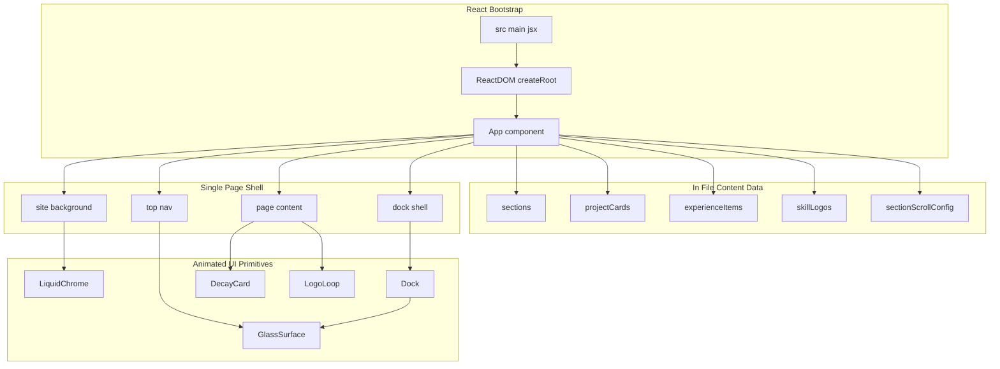
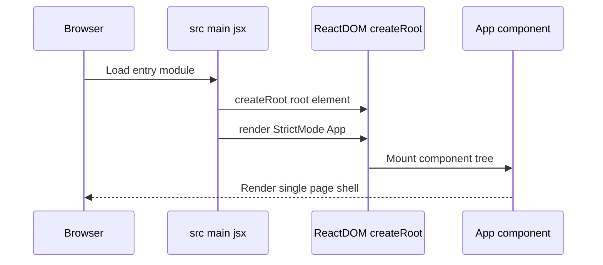
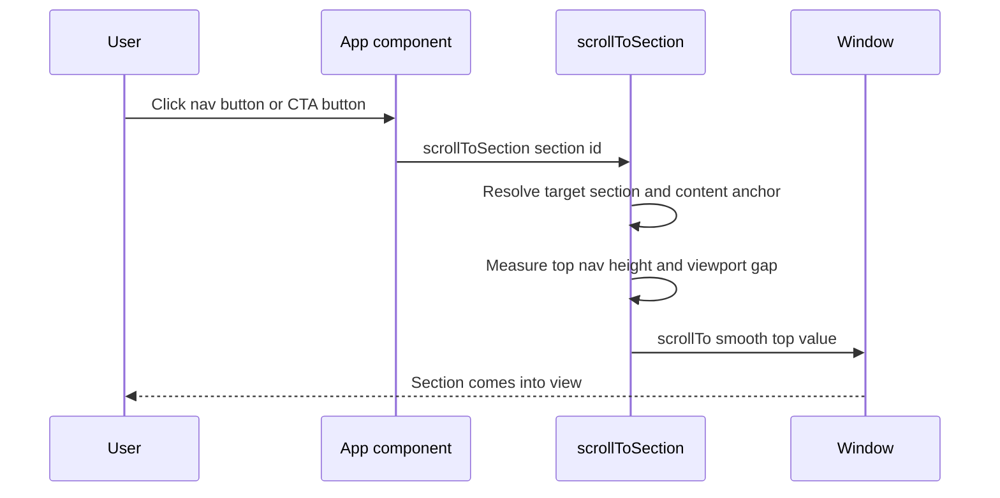
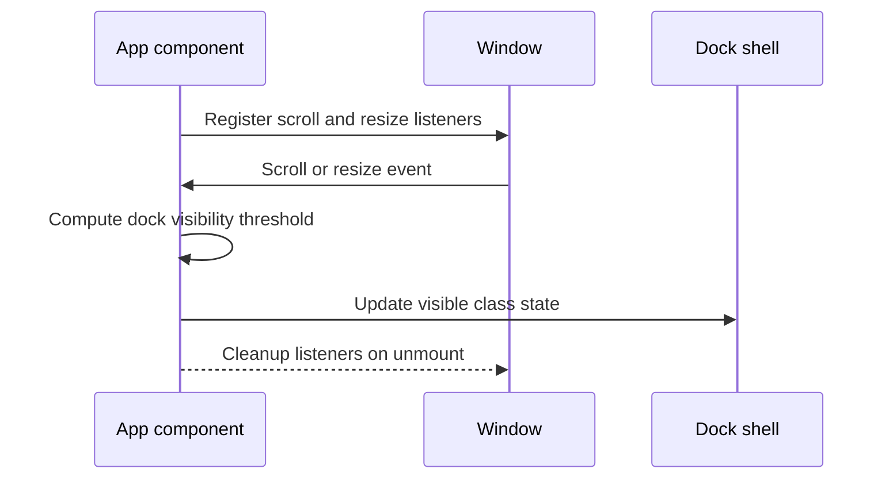

# Single-page shell, section model, and content datasets

# Application Architecture and Page Composition

*File focus: `src/main.jsx`, `src/App.jsx`*

## Overview

This part of the application is the entire page shell for the portfolio site.  performs the React bootstrap, and  owns the full single-page composition: the animated background, top navigation, section anchors, content datasets, and the bottom dock.

The page is intentionally data-driven. The navigation labels, project cards, experience items, skill logos, and section scroll tuning all live inside  as local arrays or config objects, so the visible site structure is controlled from one file rather than spread across route files or feature modules. That keeps the repository compact while still letting the page render distinct home, experience, projects, skills, and contact areas.

The result is a single-page shell with semantic sections and shared animated primitives such as `LiquidChrome`, `GlassSurface`, `DecayCard`, `Dock`, and `LogoLoop`. These components are orchestrated from one top-level app component, which makes the page easy to read as a composition map rather than a routed application.

## Architecture Overview

## React Bootstrap

### 

*File:* *`src/main.jsx`*

 is the entry point that mounts the application into the DOM. It imports `React`, `ReactDOM`, `App`, and the global stylesheet, then renders `App` inside `React.StrictMode` with `ReactDOM.createRoot(document.getElementById('root'))`.

#### Bootstrap responsibilities

- Locates the root DOM node by `id="root"`.
- Creates the React root with `ReactDOM.createRoot`.
- Renders the top-level `App` component.
- Wraps the tree in `React.StrictMode`.
- Loads  before the app renders.

#### Public identifiers

| Identifier | Type | Description |
| --- | --- | --- |
| `ReactDOM.createRoot` | function call | Creates the React root attached to the `root` element. |
| `App` | component | Top-level application component rendered into the root. |

#### Mount flow

## Top-Level App Shell

### 

*File:* *`src/App.jsx`*

`App` is the architectural center of the page. It owns the section shell, the animated background, the top navigation state, the dock visibility state, and the inline datasets that drive the visible content. The page is built as a single scrolling document with section IDs instead of routes.

#### Component responsibilities

- Renders the site shell with background, header, main content, and dock.
- Drives mobile menu state with `isMobileMenuOpen`.
- Drives dock visibility with `isDockVisible`.
- Maps section metadata into navigation buttons.
- Maps content datasets into the experience, projects, skills, and contact sections.
- Provides the scroll helper used by the nav buttons and call-to-action buttons.

#### Internal state

| State | Type | Description |
| --- | --- | --- |
| `isMobileMenuOpen` | boolean | Controls the open and closed class state for the top navigation on small screens. |
| `isDockVisible` | boolean | Controls whether the bottom dock shell receives the visible class. |

#### Internal helpers

| Helper | Type | Description |
| --- | --- | --- |
| `scrollToSection` | function | Scrolls to a section by `id`, using section-specific offsets and element selectors to align content under the fixed top nav. |
| `handleNavClick` | function | Calls `scrollToSection(id)` and closes the mobile navigation menu. |

#### Rendered composition map

| Shell area | Component or element | Purpose |
| --- | --- | --- |
| Background layer | `LiquidChrome` and `.background-vignette` | Animated backdrop behind the page content. |
| Header | `GlassSurface`, brand block, menu button, nav buttons | Top navigation and branding. |
| Main content | `hero-section`, `experience`, `projects`, `skills`, `contact` | Semantic one-page sections. |
| Projects | `DecayCard` | Animated project cards with image displacement. |
| Skills | `LogoLoop` | Continuous looping technology logo strip. |
| Contact | Icon links and `VelogMark` | Direct outbound contact targets. |
| Dock | `Dock` | Quick navigation controls anchored near the bottom. |

#### Section navigation helpers

`scrollToSection` uses `document.getElementById(id)` to find the target section. For each section, it applies a tuned content anchor derived from `sectionScrollConfig`, then subtracts the height of `.top-nav` plus a viewport gap before calling `window.scrollTo({ behavior: 'smooth' })`.

| Section id | Selector preference | Offset |
| --- | --- | --- |
| `home` | none | `50` |
| `experience` | `.glass-panel` | `92` |
| `projects` | `.card-grid` | `240` |
| `skills` | `.contact-card` | `280` |
| `contact` | `.contact-card` | `260` |

#### `scrollToSection` flow

## Content Datasets

The page is data-driven through local arrays and config objects in . Each dataset feeds a separate portion of the shell, which keeps the content structure compact and easy to read.

### Navigation sections

*File:* *`src/App.jsx`*

`sections` is the source of truth for the top navigation buttons.

| Property | Type | Description |
| --- | --- | --- |
| `id` | string | Section anchor used by `scrollToSection` and the section `id` attribute. |
| `label` | string | Visible text in the top navigation button. |

| id | label |
| --- | --- |
| `home` | `Home` |
| `experience` | `Experience` |
| `projects` | `Projects` |
| `skills` | `Skills` |
| `contact` | `Contact` |

### Project cards

*File:* *`src/App.jsx`*

`projectCards` is mapped into `DecayCard` instances in the projects section.

| Property | Type | Description |
| --- | --- | --- |
| `title` | string | Main label displayed inside the card. |
| `subtitle` | string | Secondary label displayed below the title. |
| `image` | string | Image URL passed to `DecayCard`. |

| title | subtitle | image |
| --- | --- | --- |
| `Studio` | `Interactive Landing Page` | `https://picsum.photos/id/1011/900/1200?grayscale` |
| `System` | `Design System Library` | `https://picsum.photos/id/1005/900/1200?grayscale` |
| `Commerce` | `Product Experience` | `https://picsum.photos/id/1025/900/1200?grayscale` |

### Experience items

*File:* *`src/App.jsx`*

`experienceItems` drives the stacked experience list in the experience section.

| Property | Type | Description |
| --- | --- | --- |
| `role` | string | Primary heading for the experience entry. |
| `company` | string | Secondary label shown under the role. |
| `description` | string | Body copy for the experience entry. |

| role | company | description |
| --- | --- | --- |
| `Full Stack Developer` | `Product Engineering` | `Built end-to-end product features across frontend and backend, from responsive interfaces and API integration to deployment-ready application flows.` |
| `Frontend & Backend Collaboration` | `Design Systems + Services` | `Worked closely with designers and backend teams to translate product requirements into scalable UI components, service layers, and consistent user experiences.` |
| `Web Application Development` | `Interfaces, APIs, and Data` | `Focused on building maintainable web applications with thoughtful interaction, reliable data handling, and a strong eye for product polish.` |

### Skill logos

*File:* *`src/App.jsx`*

`skillLogos` is passed into `LogoLoop` in the skills section.

| Property | Type | Description |
| --- | --- | --- |
| `node` | React node | Inline icon element rendered by `LogoLoop`. |
| `title` | string | Human-readable name for the technology. |
| `href` | string | Outbound link used by `LogoLoop` when the item is clickable. |

| title | href |
| --- | --- |
| `GitHub` | `https://github.com/kannikii` |
| `React` |  |
| `Node.js` |  |
| `Spring Boot` | `https://spring.io/projects/spring-boot` |
| `MySQL` |  |
| `JavaScript` | `https://developer.mozilla.org/docs/Web/JavaScript` |
| `Java` |  |
| `Python` |  |
| `C++` |  |

### Section scroll tuning

*File:* *`src/App.jsx`*

`sectionScrollConfig` keeps the page aligned when a section is scrolled into view. Each entry provides a preferred content selector and a viewport offset used by `scrollToSection`.

| Section | selector | offset |
| --- | --- | --- |
| `home` | `null` | `50` |
| `experience` | `.glass-panel` | `92` |
| `projects` | `.card-grid` | `240` |
| `skills` | `.contact-card` | `280` |
| `contact` | `.contact-card` | `260` |

## Page Composition by Section

### Home

The home section is the hero entry point for the entire page. It includes the `hero-badge`, a single headline, a descriptive paragraph, and two call-to-action buttons that jump to the projects and experience sections.

| Element | Purpose |
| --- | --- |
| `hero-badge` | Quick role label: `Full Stack Developer`. |
| `h1` | Main positioning statement for the portfolio. |
| `hero-copy` | Short explanation of the stack and workflow focus. |
| `cta-primary` | Scrolls to `projects`. |
| `cta-secondary` | Scrolls to `experience`. |

### Experience

The experience section pairs a section heading with a `.glass-panel` list built from `experienceItems`. Each entry uses the `role` and `company` fields as a header block, followed by a descriptive paragraph.

| Rendered element | Data source |
| --- | --- |
| `h3` | `item.role` |
| `span` | `item.company` |
| `p` | `item.description` |

### Projects

The projects section uses `projectCards` to render three `DecayCard` components in `.card-grid`. Each card gets a fixed height of `520` and an image URL from the dataset.

| Rendered element | Data source |
| --- | --- |
| `DecayCard` title | `card.title` |
| `DecayCard` subtitle | `card.subtitle` |
| `DecayCard` image | `card.image` |

### Skills

The skills section places a descriptive paragraph above `LogoLoop`. The logo loop consumes `skillLogos` and renders a continuously moving, hover-reactive strip of technology marks.

| Rendered element | Data source |
| --- | --- |
| `LogoLoop` content | `skillLogos` |
| `ariaLabel` | `Skills and technology logos` |
| `logoHeight` | `48` |
| `gap` | `56` |

### Contact

The contact section uses a stacked card with a short description and three outbound links. The links point to GitHub, Gmail, and Velog, and each tile includes an icon, a label, and a secondary line of text.

| Tile | Destination |
| --- | --- |
| GitHub | `https://github.com/kannikii` |
| Gmail | `mailto:kwnnh0124@dgu.ac.kr` |
| Velog | `https://velog.io/@kannikii/posts` |

## Shared Marks

### `BrandMark`

*File:* *`src/App.jsx`*

`BrandMark` is the site mark displayed next to `Kannikii` in the top navigation. It is a self-contained SVG component with three stroked paths that create the circular brand symbol.

#### Properties

| Property | Type | Description |
| --- | --- | --- |
| `className` | string | Static class name `brand-mark` applied to the SVG element. |
| `viewBox` | string | Fixed to `0 0 48 48`. |
| `fill` | string | Set to `none`. |
| `aria-hidden` | boolean | Set to `true` so the icon stays decorative. |

### `VelogMark`

*File:* *`src/App.jsx`*

`VelogMark` is the custom SVG used in the contact section for the Velog link. It renders a rounded square background with a stylized `V` mark in the center.

#### Properties

| Property | Type | Description |
| --- | --- | --- |
| `viewBox` | string | Fixed to `0 0 24 24`. |
| `fill` | string | Set to `none`. |
| `aria-hidden` | boolean | Set to `true` so the icon stays decorative. |

## State and Interaction Model

`App` uses a small amount of local state and imperative DOM work to keep the single-page shell responsive.

| Pattern | Implementation |
| --- | --- |
| Mobile menu toggle | `setIsMobileMenuOpen((open) => !open)` in the menu button click handler. |
| Dock reveal toggle | `setIsDockVisible(...)` inside a `useEffect` listener pair for `scroll` and `resize`. |
| Section jump behavior | `scrollToSection(id)` resolves the target section and uses `window.scrollTo`. |
| Menu auto-close on navigation | `handleNavClick` calls `setIsMobileMenuOpen(false)` after scrolling. |

### Dock visibility behavior

`useEffect` installs `scroll` and `resize` listeners and removes them during cleanup. On mobile viewports, the dock becomes visible after `window.scrollY > 120`. On wider viewports, it becomes visible when the bottom of the viewport reaches within `220` pixels of the document end.

## Dependencies

The page shell depends on a small set of local animated primitives and icon packages that are wired directly inside .

| Dependency | Role in this section |
| --- | --- |
| `react` | Supplies `useEffect`, `useState`, and component rendering. |
| `react-dom/client` | Boots the app in . |
| `lucide-react` | Provides the navigation and dock icons. |
| `react-icons/si` | Provides the technology and contact icons. |
| `LiquidChrome` | Animated page background. |
| `GlassSurface` | Glass effect used by the nav and dock. |
| `DecayCard` | Project card renderer. |
| `Dock` | Quick navigation dock. |
| `LogoLoop` | Scrolling skills logo strip. |

## Key Classes Reference

| Class | Responsibility |
| --- | --- |
| `main.jsx` | React bootstrap entry point that mounts `App` into `#root`. |
| `App.jsx` | Single-page shell, content datasets, section composition, and navigation-scrolling logic. |

---
Source: https://app.docuwriter.ai/space/42709/item/494712
